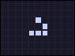
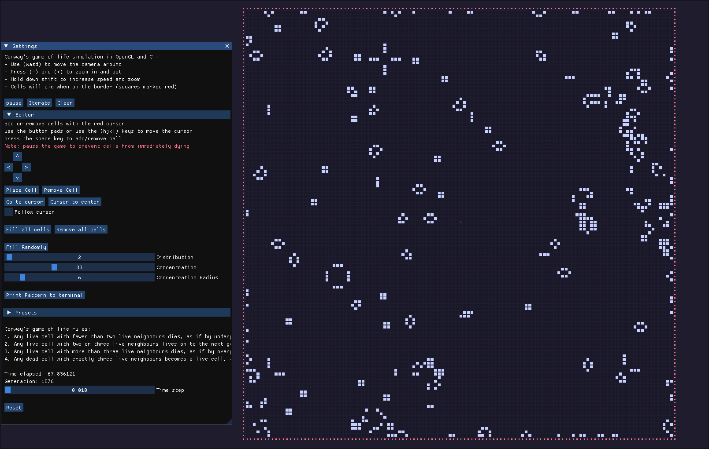
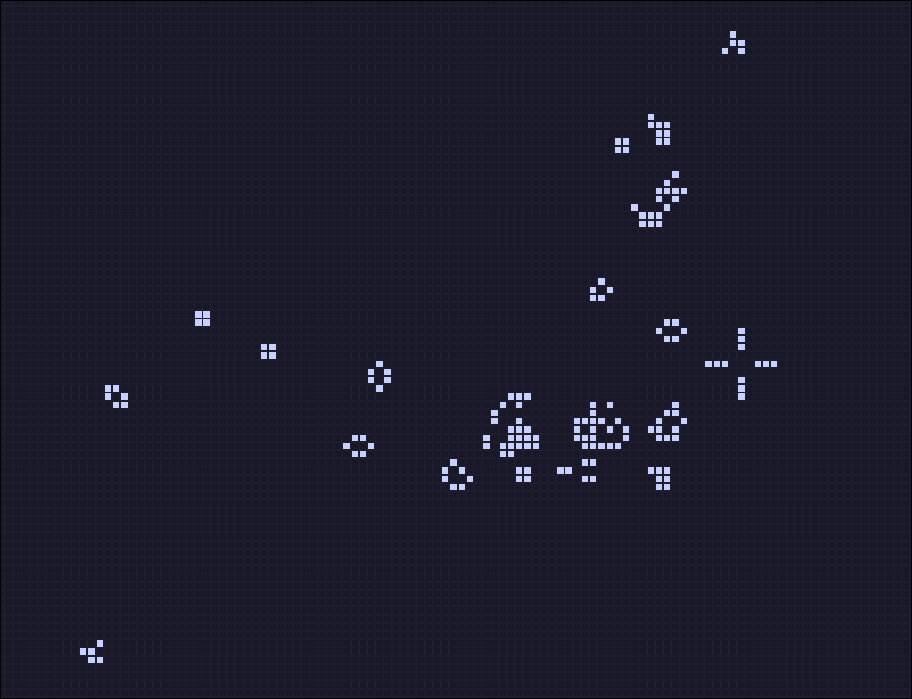
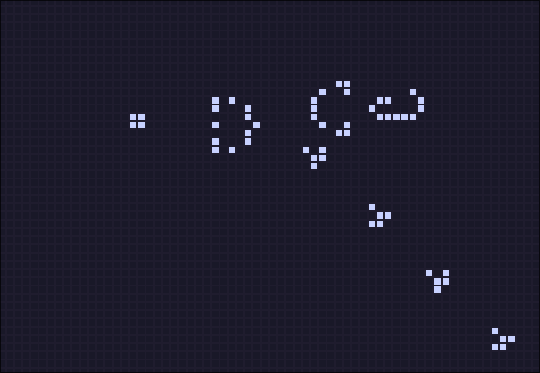

# cgol
Conway's game of life simulation in C++ and OpenGL



# Building
Copy and clone the git url

Inside the directory create the build using cmake
```
mkdir build
cd build
cmake ..
```
Build using ```make``` on linux

Use ```cmake --build .``` on Windows

# Edit with ImGui
Press the 'c' key to open the settings window.
Add and remove cell using the editor.



# Screenshots



